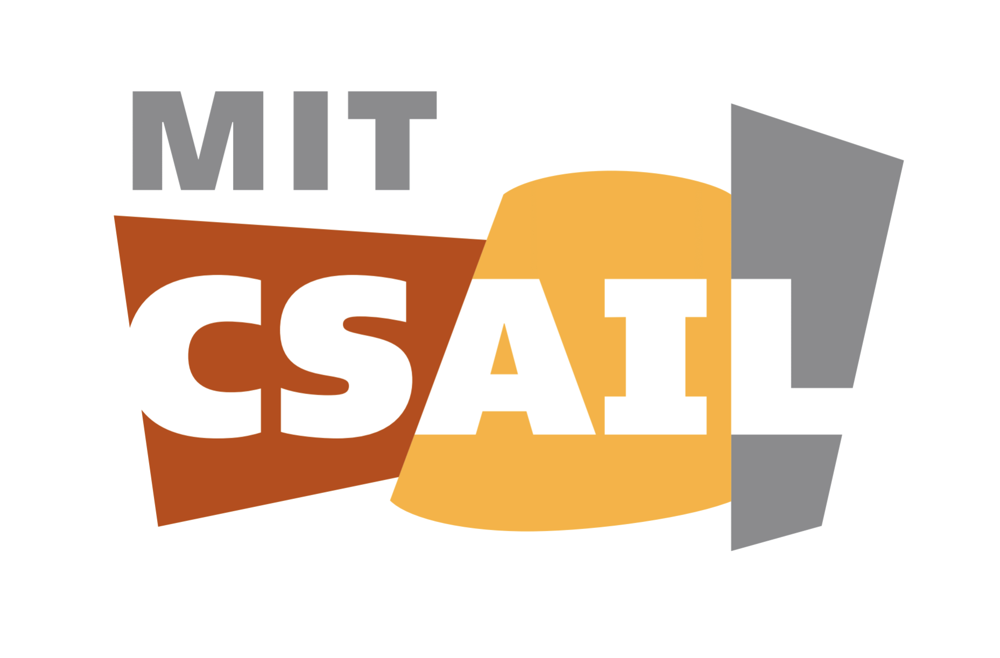

<link rel="stylesheet" href="../assets/css/timeline.css">

<body>
    

   

	<!-- Timeline Item, copy from here to create various boxes -->
	

		<!--Icon inside the circle-->
		

			
		

		<!-- Content from timeline box and position (right or left)-->
		

			<h2>  &nbsp; &nbsp; Bonnie Berger Lab </h2>
             
			
<i class='fas fa-id-badge'></i> &nbsp;Research Assistant 

			

                <ul>
                <li>Working on diffusion models for genome structure (via scHi-C) and protein structure conformational change.</li>
                <li>Accepted into the Broad Summer Research Program (BSRP) starting June</li>
                </ul>
			

            
<i class='fas fa-calendar'/> &nbsp; <em>May 2023 - Present</em>

			
<i class='fas fa-map-marker-alt'></i> <em>&nbsp;Cambridge, MA </em> 

			<!-- <a href="#" class="btn">button</a> -->
		

	

	

		<!--Icon inside the circle-->
		

			
		

		<!-- Content from timeline box and position (right or left)-->
		

			<h2>  &nbsp; &nbsp; Jian Ma Lab </h2>
             
			
<i class='fas fa-id-badge'></i> &nbsp;Research Assistant 

			

                <ul>
                <li>Using Hypergraph GNNs to predict trigenic interactions in the yeast genome, specifically those with protein structural significance</li>
                <li>Applying Gaussian Processes to pair our model's predictions with an uncertainty score</li>
                </ul>
			

            
<i class='fas fa-calendar'/> &nbsp; <em>Dec 2021 - Present</em>

			
<i class='fas fa-map-marker-alt'></i> <em>&nbsp;Carnegie Mellon University, PA </em> 

			<!-- <a href="#" class="btn">button</a> -->
		

	

    

		<!--Icon inside the circle-->
		

			
		

		<!-- Content from timeline box and position (right or left)-->
		

			<h2>  &nbsp; &nbsp; Xiuwei Zhang Lab</h2>
             
			
<i class='fas fa-id-badge'></i> &nbsp;Research Assistant 

			

                <ul>
                <li>Developed Clarify, a method for refinining extracellular and intracellular interactions with and Spatial Transcriptomics data</li>
                <li>Benchmarking current Spatial Transcriptomics + CCI methods</li>
                </ul>
			

			

			
<i class='fas fa-calendar'/> &nbsp; <em>Nov 2021 - Present</em>

			
<i class='fas fa-map-marker-alt'></i> <em>&nbsp;Georgia Institute of Technology, GA </em> 

			

			<!-- <a href="#" class="btn">button</a> -->
        

	

    

		<!--Icon inside the circle-->
		

			
		

		<!-- Content from timeline box and position (right or left)-->
		

			<h2>&nbsp; Bioinf. Intern @ Boundless Bio</h2>
             
			
<i class='fas fa-id-badge'></i> &nbsp;Bioinformatics Research Intern 

			

                <ul>
                <li>Provisional patent for creating metaDetect: a computer vision algorithm for identifying metaphase spreads in stained WSI of cancer cells using image filtering techniques</li>
                <li>Created automated pipeline for whole slide imaging → metaDetect (CV) → ecDNA quantification (CNN)</li>
                </ul>
			

            
<i class='fas fa-calendar'/> &nbsp; <em>Aug 2020 - Dec 2021</em>

			
<i class='fas fa-map-marker-alt'></i> <em>&nbsp;San Diego, CA </em> 

			<!-- <a href="#" class="btn">button</a> -->
        

	

    

		<!--Icon inside the circle-->
		

			
		

		<!-- Content from timeline box and position (right or left)-->
		

			<h2>&nbsp; BS/MS in Computer Science</h2>
             
            
<i class='fas fa-map-marker-alt'></i> <em>&nbsp; Georgia Institute of Technology, GA</em> 

			

                <ul>
                <li>GPA - 4.0/4.0</li>
                <li>Specializing in Machine Learning/Theory</li>
                <li>B.S. complete May 2023</li>`
                <li>M.S. in ML complete May 2024</li>
                </ul>
			

            
<i class='fas fa-calendar'/> &nbsp; <em>Aug 2020 - May 2023 </em>(<i class='fas fa-graduation-cap'></i>)
	
			<!-- <a href="#" class="btn">button</a> -->
        

	

    

		<!--Icon inside the circle-->
		

		

	

</body> 
